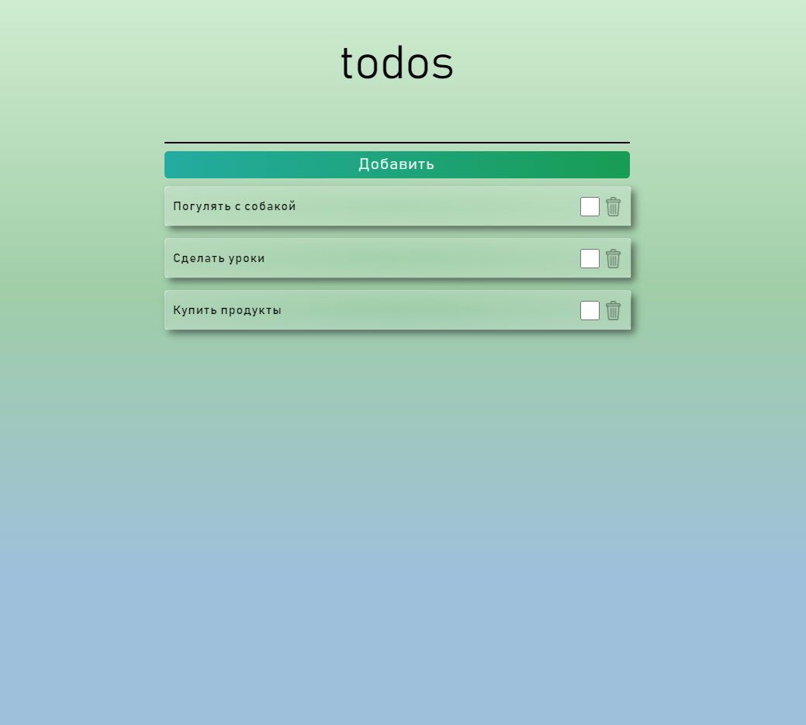

# todoApp

В данном проекте представлено приложение, запоминающие список запланированных дел.

## Цель проекта
 + Получение опыта работы с Local Storage.

## Запуск проекта
###  https://artem-suz.github.io/todoApp-JS/

## Функционал
+ Кнопка **Добавить** сохраняет и выводит карточку с  запланированным делом. 
+ Кнопка **Урна** удаляет запланированное дела.
+ Кнопка **Чекбокс** отмечает запланированное дело как выполненное. Выполненные карточки группируются снизу.

## Используемые технологии

* [HTML](https://developer.mozilla.org/ru/docs/Learn/Getting_started_with_the_web/HTML_basics) - язык разметки веб-страницы.
* [SASS](https://sass-scss.ru/documentation/sintaksis/) - препроцессор CSS для описания внешнего вида HTML-документа
* [JS](https://developer.mozilla.org/ru/docs/Learn/JavaScript/First_steps/What_is_JavaScript) - язык программирования позволяющий создать динамичные веб-приложения.
* [Gulp](https://webdesign-master.ru/blog/docs/gulp-documentation.html) - сборщик проекта.

## Вид интерфейса

